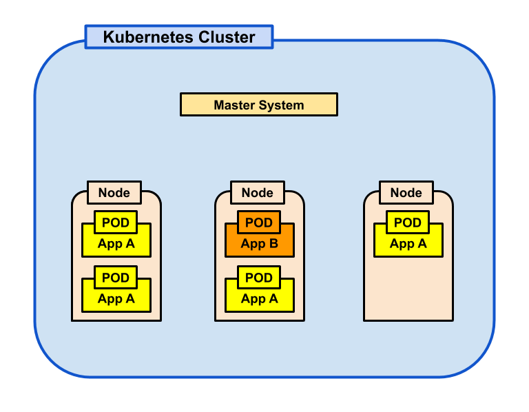
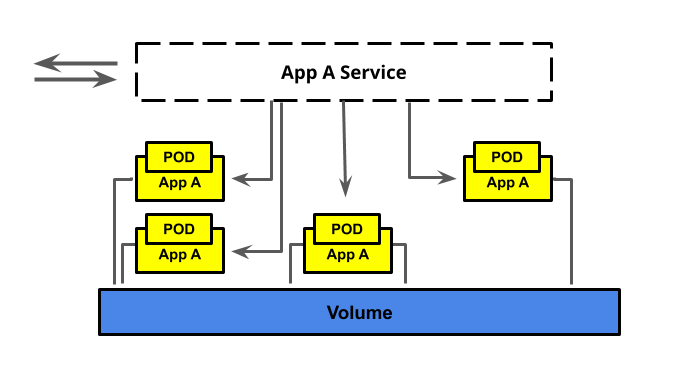
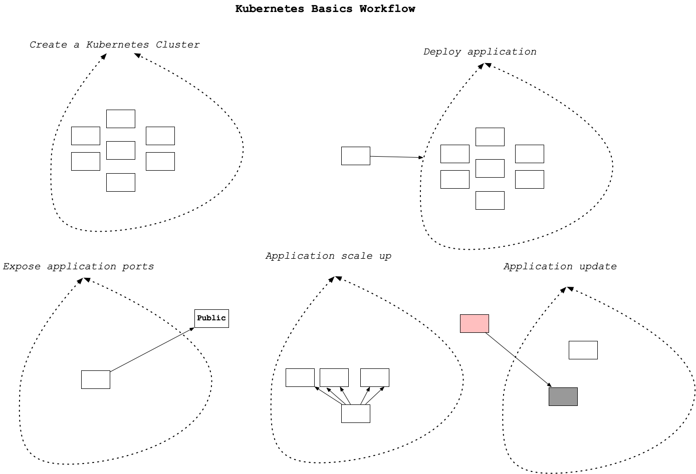
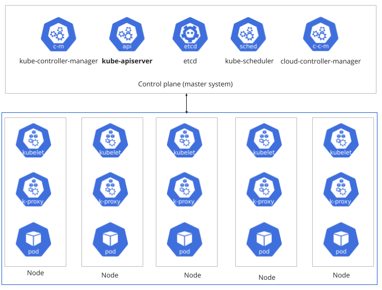

## Kubernetes
Types of scaling
1. **Vertical scaling** Increasing the host machine's hardware resources on which the container is running is called vertical scaling. Earlier, we learned that a container has no resource constraints and can use as much of a given resource as the host's kernel scheduler allows. This approach's downside is that
    - It is challenging to scale up-or-down as the demand changes automatically.
    - Larger host machines can be more expensive than smaller machines, so it is a loss if the machine is underutilized. Also, running an application in a single container alone doesn’t leverage the full power of containerization.
2. **Horizontal scaling** Running multiple instances of the same application across multiple machines is called horizontal scaling. It is effortless to run multiple containers based on the same image.


### Why is Kubernetes required?
In the last lesson, you learned to containerize your application. The containers that you created were running locally on your machine. There are limitations to containerizing applications locally, such as:
1. **Scaling** - You cannot automatically scale up-or-down the resources (number of containers) or application usage requirements based on the incoming traffic.
2. **Updates** - Assume you have manually scaled up your containers horizontally on multiple hosts. Now, develop a patch/update in your application. It will be difficult for you to update the patch in each container manually.
3. **Elasticity** - Your local computer/on-premise servers may not suffice the hardware requirements for running too many containers parallelly.<br>

The solution to auto-scaling problems #1 and #2 above is to use the Kubernetes. The solution to problem #3 above is to use elastic (unlimited) resources on the cloud.


### What is Kubernetes?
Kubernetes is one of the most popular orchestration system for containers developed by Google and open sourced in 2014. It can automate many of the manual operations of deployment and scaling of a containerized application. A few of the benefits of using Kubernetes (k8s) are:
- The ease of scaling the container instances up or down to meet varying demands (horizontal scaling).
- It can balance loads, and perform health checks.
- It helps in setting-up inter-container communication (networking). <br>

Kubernetes was born out of the lessons learned in the [Scaling containerized apps at Google](https://queue.acm.org/detail.cfm?id=2898444).

### Benefits of using Kubernetes
A few more benefits of using Kubernetes are:
- High availability architecture
- Auto-scaling
- Rich Ecosystem
- Service discovery
- Container health management
- Secrets and configuration management. <br>

The downside of these features is the high complexity and learning curve of Kubernetes.

### Key Terms
- *Cluster*: A group of machines running Kubernetes
- *Master*: The system which controls a Kubernetes cluster. You will typically interact with the master when you communicate with a cluster. The master includes an api, scheduler, and management daemon.
- *Nodes*: The machines in a cluster. These can be virtual, physical, or a combination of both.
- *[Pods](https://kubernetes.io/docs/concepts/workloads/pods/)*: It is considered as the smallest unit in a cluster. It is a logical group of containers on a node that runs a particular module/application. A pod consists of one or more containers, shared storage resources, and a unique IP address. Note that all the containers within a Pod share the namespaces and filesystem volumes. Because pod memory is temporary, they can be connected to a *volume* for long term storage. Pods are not persistent, and may be brought up and down by the master during scaling. 

## Kubernetes Cluster Architecture
The core of Kubernetes is the cluster. A cluster comprises several node machines for running containerized applications and a master for managing the nodes. Each node is capable of running multiple pods (a group of containers). Therefore, each node has a container runtime, such as Docker, installed on it. <br>
The diagram below shows a simplistic view of a Kubernetes cluster.

<p align="center">
  <br>
  <span>Kubernetes clusters consist of a master system, nodes, pods, and services.</span>
</p>
<br>

Note the following points about the Kubernetes architecture:
1. Nodes are managed by the Master system. **Each node in the cluster must have a container runtime, such as Docker**.
2. A given node can host multiple PODs.
3. The PODs (a logical group of containers) are running independent modules of an application. In the last lesson, it was a single container running a module.
4. The PODs are replicated across multiple nodes. <br>

You can view a detailed version of the cluster architecture [here](https://kubernetes.io/docs/concepts/overview/components/).

### Reliability
In the cluster diagram shown above, each POD runs a specific module (App A, App B, App C...) of an application. Moreover, the PODs are not attached to a specific node (host). Instead, multiple nodes are hosting similar PODs. This architecture mitigates the chances of a single point of failure, and thus provides high availability. The master system brings a layer of abstraction for the external client/application.

### Service and Volumes
All pods that are running the same application module share storage resources. Further, all the containers within a pod share the namespaces and filesystem volumes. Hence, in order to have a persistent way to store data, volumes can be attached to pods.<br>
Whereas, in order to have a persistent way to communicate with ephemeral pods, a higher-level service abstraction is provided, called *Kubernetes Service*.<br>
*Service*: An abstraction of a set of pods and interface for how to interact with the pods

<p align="center">
  <br>
  <span>Kubernetes pods with a connected service and attached volume.</span>
</p>


### How does it work? (High-level)
The following diagram shows the core operations involved in Kubernetes
1. Creating a Kubernetes Cluster
2. Deploying an application into the cluster
3. Exposing application ports
4. Scaling an application
5. Updating an application

<p align="center">
  <br>
  <span>5-steps of Kubernetes basics workflow</span>
</p>
<br>

### How do you set up a Kubernetes cluster?
There are two main methods:
1. Set up a local cluster (preferably with Docker Desktop) - If you are using Docker and have enabled Kubernetes then you already have a standalone Kubernetes server running. Creating local clusters is beyond the scope of this course. However, we have dropped the link to a great tutorial at the bottom of this page.
2. Provision a cloud cluster. Most cloud service providers offer a managed Kubernetes service:
- Amazon through Amazon EKS
- Google through Google Kubernetes Engine GKE
- Microsoft through Azure Kubernetes Service (AKS). **In this course, you will learn to use Amazon EKS**.

### External Resourcces
1. Must Read Moving forward, we will be using Amazon EKS to create and manage a cluster for us. Before that, we encourage you to get an insight about the Kubernetes, its components, and Kubernetes API from the official documentation. This will help you gain a good understanding of cluster architecture and its working.
2. [Optional] Want to learn how to create a cluster locally? 
<br>

Read through a [quick primer](https://kubernetes.io/docs/tutorials/kubernetes-basics/create-cluster/cluster-intro/) beforehand, and follow this [amazing demo](https://github.com/katacoda-scenarios/kubernetes-bootcamp-scenarios) yourself


***

### Kubernetes Components
You can consider a cluster as a collection of
- **Worker nodes** (virtual-machines): These nodes run the containerized applications. A cluster must have at least one worker node. Each worker node hosts the pod(s), where, a pod is a logical group of running containers.
- **A master-system**: This system manages the overall cluster. It manages load balancing, backup, replication, scheduling, and much more.
The master-system is actually a **control plane comprising a few components**.

<p align="center">
  <br>
  <span>Kubernetes components</span>
</p>
<br>

### What is a control plane?
The control plane manages the worker nodes and the Pods in the cluster. For example, it decides when to start up a new pod, or scheduling other events. It comprises the following [components](https://d33wubrfki0l68.cloudfront.net/2475489eaf20163ec0f54ddc1d92aa8d4c87c96b/e7c81/images/docs/components-of-kubernetes.svg):

1. **kube-apiserver** - This is the core component. It is an API server that exposes the Kubernetes API. In simple words, the kube-apiserver is the frontend for the control plane. It has **two main purposes**:
    - It exposes an HTTP API that allows end-users, different parts of your cluster, and external components to communicate.
    - It allows querying and manipulating the state of API objects (Pods, Namespaces, ConfigMaps, and Events).
2. *etcd* - It is a key-value store of the cluster data.
3. *kube-scheduler* - It monitors pods. It assigns a worker-node to the newly created pods.
4. *kube-controller-manager* - It is an abstract layer that runs controller processes.
5. *cloud-controller-manager* - It embeds cloud-specific control logic and lets you link your cluster into your cloud provider's API

### What's there in a worker node?
A worker node comprises of the following:
1. *kubelet* - There should be an agent on each node that tracks that containers are running in the correct Pod. That agent is a kubelet.
2. *kube-proxy* - It maintains network rules on nodes. These network rules allow network communication to your Pods from network sessions inside or outside of your cluster.
3. *Container runtime* - Of course, each worker-node needs a container runtime, such as Docker, contained, CRI-O, or any other to run the containers.
<br>

**Reference**
- [Kubernetes Components](https://kubernetes.io/docs/concepts/overview/components/)
- [Kubernetes API](https://kubernetes.io/docs/concepts/overview/kubernetes-api/)

***

### Amazon Elastic Kubernetes Service (EKS)
It is a managed Kubernetes service, that has the following offerings:
- EKS uses a **control layer** that runs the master nodes
- We can specify the size, type, and count of the worker nodes
- EKS allows auto-scaling (increasing-decreasing the worker node's count)
- EKS takes care of the automated back-ups, maintenance, and availability of the cluster
- Secure networks are set up automatically
- You only set up Nodes, Pods, and Services

If you are running your application on EKS, then you can invest your time more on application development and deployment. You do not have to worry about the underlying infrastructure or its health.<br>

[What is Amazon EKS?](https://docs.aws.amazon.com/eks/latest/userguide/what-is-eks.html)


***
### Creating an EKS Cluster in the AWS Web console. 
1. [Prerequesites](./03_AWS_EKS_Cluster_Setup_Web_Console.md#1-prerequesites)
2. [Create an EKS Cluster](./03_AWS_EKS_Cluster_Setup_Web_Console.md#2-creating-an-eks-cluster)
3. [Create an EKS Node Group](./03_AWS_EKS_Cluster_Setup_Web_Console.md#3-creating-an-eks-nodegroup)
4. [Post Creation](./03_AWS_EKS_Cluster_Setup_Web_Console.md#4-post-creation)

### Creating an EKS Cluster using the EK CTL command line tool
1. Install `eksctl` with brew.
    ```bash
    ~ $brew tap weaveworks/tap
    ~ $brew install weaveworks/tap/eksctl
    ```
2. Create a simple cluster using `eksctl create cluster`. **NOTE**: The default commands install two ``m5 large`` EC2 instances by default so be careful not to leave them running for long.
    - Additional details can be specified with cli arguments e.g. `eksctl create cluster --name myCluster --nodes=4`
    - Clusters can also be created with **configuration yaml files** `eksctl create cluster --config-file=<path>`. More details are provided [here](https://eksctl.io/).
3. List the details about the existing cluster(s) `eksctl get cluster [--name=<name>][--region=<region>]`
4. Run a simple command, it will delete the cluster as well as all the associated resources `eksctl delete cluster --name=<name> [--region=<region>]`
5. `kubectl` is a command line tool for running commands against a kubernetes cluster. Check if kubectl was installed with Docker. It was automatically installed for me when I installed Docker Desktop.
    ```bash
    ~ $kubectl version --client
    Client Version: v1.28.2
    ```
    - It can be used to deploy services and check the *health status* of pods on the cluster.
    <br><br>

6. Creation Implementation
    ```bash
    # Create an EKS cluster - this takes a while (almost 10 minutes)
    ~ $eksctl create cluster --name eksctl-demo --nodes=2 --version=1.28 --instance-types=t2.medium --region=us-east-2

    # After cluster has been created, check the health status of the cluster nodes with
    ~ $kubectl get nodes
    NAME                                           STATUS   ROLES    AGE     VERSION
    ip-192-168-52-106.us-east-2.compute.internal   Ready    <none>   4m55s   v1.27.7-eks-e71965b
    ip-192-168-87-125.us-east-2.compute.internal   Ready    <none>   4m54s   v1.27.7-eks-e71965b

    # Delete the cluster after creation using the cluster name  - this takes a while too
    ~ $eksctl delete cluster eksctl-demo
    ```
    - You can check the status of the cluster being created under the `Cloud Formation` tab in AWS web console.
    - **Known Issue** - Sometimes, the cluster creation may fail in the *us-east-1* region. In such a case, use `--region=us-east-2` option. It is because the **us-east-1** region does not have sufficient capacity to support the cluster.
    - Note that we have chosen the `--version=1.28` because the local kubectl version is also close to `1.28`. You can check your local kubectl using `kubectl version --client`. The command above will take a few minutes to execute, and create an EKS cluster "eksctl-demo" with:
        1. One node group containing two nodes
        2. Two subnets in separate availability zones
        3. Two separate CloudFormation stacks - one for the cluster, and other for the initial nodegroup
    After the cluster has been created, the appropriate kubernetes configuration will be added to your kubeconfig file `~/.kube/config` by default, so that you can interact with the cluster using the `kubectl` commands. For more information on creating and managing clusters, refer [here](https://eksctl.io/usage/creating-and-managing-clusters/).
    <br><br>

7. Go to the [CloudFormation console](https://us-east-2.console.aws.amazon.com/cloudformation/) to view progress. If you don’t see any progress, be sure that you are viewing clusters in the same region that they are being created.<br>
    In case of issues, you can try: `eksctl utils describe-stacks --region=us-east-2 --cluster=eksctl-demo`

8. Once the status is CREATE_COMPLETE in the CloudFormation web-console, fetching the details of the newly created cluster using: `eksctl get cluster --name=eksctl-demo --region=us-east-2`
    - Go back to the CloudFormation web console and select the `eksctl-eksctl-demo-cluster` stack. Select the tab **Template**, this shows you the Cloudformation template that `eksctl` command used to create your EKS cluster. The Cloudformation template describes all of the resources and connections between them that are needed for a cluster. We will discuss Cloudformation templates more later in the course.
    - Click the **View in Designer** button. This will give you a visual representation of the resources that make up the stack created. Close and leave the designer.
    - `eksctl` former is used to create/delete/edit a cluster, whereas `kubectl` is used to interact with the cluster.

9. Delete the newly created cluster. To clarify, there are multiple ways in which you can create and delete EKS clusters:
    1. **EKS web-console** - It may not automatically delete the associated resources, such as VPC, or subnets.
    2. **CloudFormation console** - You can use this method to delete the cluster and the associated resources. We will learn this service later in this lesson.
    3. **EKSCTL utility** - **Recommended way** <br>

    CloudFormation allows you to provision all the infrastructure resources that you will need using simple configuration (text) files, and we will learn to use CloudFormation to create other AWS resources, towards the end of this lesson. For creating an EKS cluster, AWS recommends using the EKSCTL utility. <br>

    If you do not plan to continue to the next pages/lessons right away, you must delete the cluster either using the CloudFormation web-console, or by using the EKSCTL command. Choose any one option from below:
    - From the CloudFormation web-console, select your stack and choose delete from the actions menu
    - Delete using the EKSCTL:<br>
    `eksctl delete cluster eksctl-demo  --region=us-east-2`
