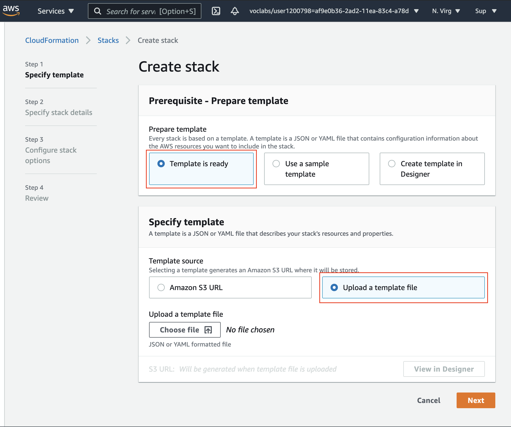
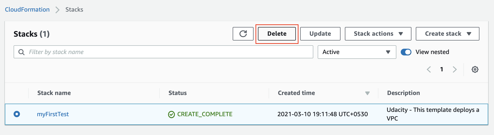
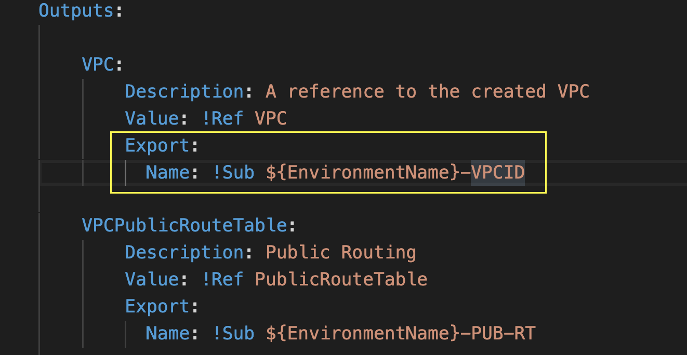
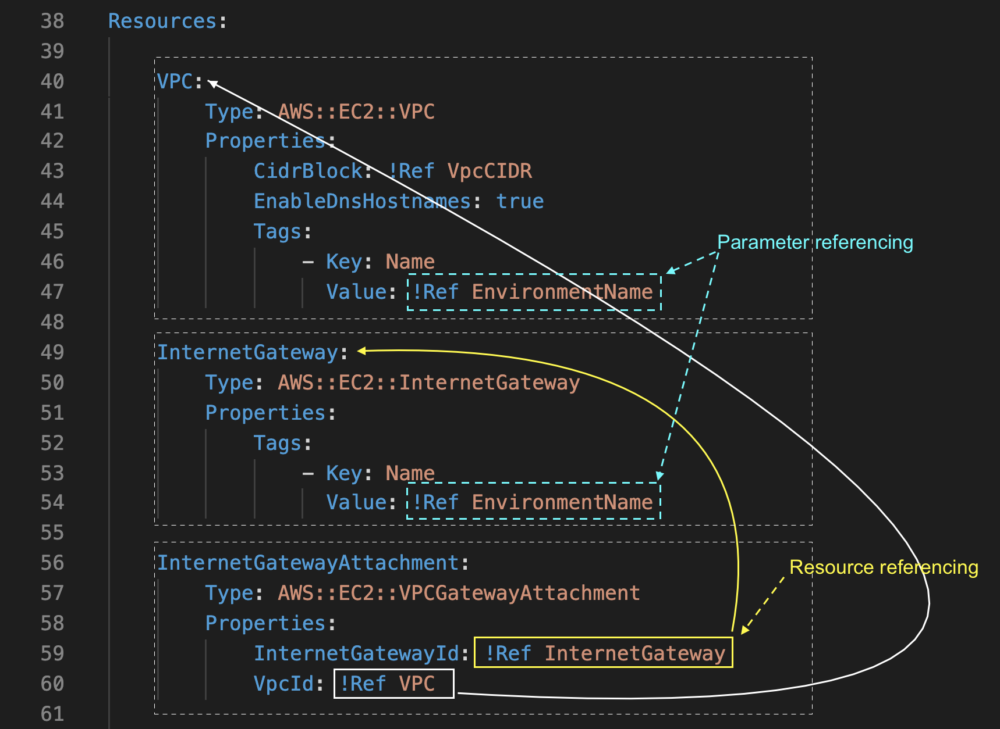

## Cloud Formation Intro
1. `myFirstTemplate.yml` is a simple example of a CloudFormation template that can be used to create an EC2 instance.
    The template above is defining the following:
    - default template format, as `2010-09-09`
    - name of the resource, as `myUdacityVPC`
    - type of resource, as `'AWS::EC2::VPC'`
    - Property fields, such as `CidrBlock`, and `EnableDnsHostnames` <br>

    Certainly, there could be many more property-fields that you can use if needed. And, as mentioned earlier, the properties of a resource vary from one type to another.<br>
    **Note**: A YAML file is indentation-sensitive.

## What is a stack?
When you run your CloudFormation template either using a CLI or the web-console, a group of resources gets created in the cloud. For example, the group of resources could comprise a VPC, one or more EC2 instances, S3 buckets, IAM roles, or any other AWS resource. <br>

This collection of resources that get created using a single script, is considered a one-logical entity called a stack. It means you can create, update, or delete a stack in just a single command.<br>

Reference: [AWS CloudFormation concepts](https://docs.aws.amazon.com/AWSCloudFormation/latest/UserGuide/cfn-whatis-concepts.html)

### 1. Create a stack using the CLI
Assume that the template file name is **myFirstTemplate.yml**, and this file is present in your current working directory locally (or navigate to the folder where this file is present). There are three basic tasks you can do:

**1. Create a new stack** <br>
Run the following command in the terminal, from the same directory where you've placed your **myFirstTemplate.yml** file:
```bash
~ $aws cloudformation create-stack  --stack-name myFirstTest --region us-east-1 --template-body file://myFirstTemplate.yml
---------------------------------------------------------------------------------------------------------------------
|                                                    CreateStack                                                    |
+---------+---------------------------------------------------------------------------------------------------------+
|  StackId|  arn:aws:cloudformation:us-east-1:115046250033:stack/myFirstTest/87f3cbc0-a030-11ee-94e2-0a00d359c40f   |
+---------+---------------------------------------------------------------------------------------------------------+
```
In the command above,
- The stack name is `myFirstTest`
- The stack will be created in the `us-east-1` region
- The stack is based on the template available at the path `file/myFirstTemplate.yml`
<br><br>

**2. Update an existing stack** <br>
The command below will update the existing stack with the changes you have mentioned in your template file:
```bash
~ $aws cloudformation update-stack  --stack-name myFirstTest --region us-east-1 --template-body file://myFirstTemplate.yml
# If a change is made in the template e.g I changed the CidrBlock port from 16 to 64.
---------------------------------------------------------------------------------------------------------------------
|                                                    UpdateStack                                                    |
+---------+---------------------------------------------------------------------------------------------------------+
|  StackId|  arn:aws:cloudformation:us-east-1:115046250033:stack/myFirstTest/87f3cbc0-a030-11ee-94e2-0a00d359c40f   |
+---------+---------------------------------------------------------------------------------------------------------+
# If no change is made in the template
An error occurred (ValidationError) when calling the UpdateStack operation: No updates are to be performed.
```
This returns an error because no changes were made to the configuration file. <br><br>

**3. Describe an existing stack** <br>
The command below will show all properties of all the resources in the stack.
```bash
~ $aws cloudformation describe-stacks --stack-name myFirstTest --region us-east-1
-------------------------------------------------------------------------------------------------------------------------------------------
|                                                             DescribeStacks                                                              |
+-----------------------------------------------------------------------------------------------------------------------------------------+
||                                                                Stacks                                                                 ||
|+-----------------------------+---------------------------------------------------------------------------------------------------------+|
||  CreationTime               |  2023-12-21T18:41:19.543000+00:00                                                                       ||
||  Description                |  Udacity - This template deploys a VPC                                                                  ||
||  DisableRollback            |  False                                                                                                  ||
||  EnableTerminationProtection|  False                                                                                                  ||
||  StackId                    |  arn:aws:cloudformation:us-east-1:115046250033:stack/myFirstTest/87f3cbc0-a030-11ee-94e2-0a00d359c40f   ||
||  StackName                  |  myFirstTest                                                                                            ||
||  StackStatus                |  CREATE_COMPLETE                                                                                        ||
|+-----------------------------+---------------------------------------------------------------------------------------------------------+|
|||                                                          DriftInformation                                                           |||
||+---------------------------------------------------------------------------+---------------------------------------------------------+||
|||  StackDriftStatus                                                         |  NOT_CHECKED                                            |||
||+---------------------------------------------------------------------------+---------------------------------------------------------+||
```
The region is important because my default aws region was set to `us-east-2`. Running the command without the region pointing to `us-east-1` will throw an error `An error occurred (ValidationError) when calling the DescribeStacks operation: Stack with id myFirstTest does not exist`. <br><br>

**4. Delete the stack** <br>
Make it a habit to delete the cloud resources once you've finished your exercise: `aws cloudformation delete-stack --stack-name myFirstTest`. **Note**: Don't forget the region if the stack was not created in your default region, and this command does not return any output.


<br><br>

### Create a stack using the web-console
The exercise above can also be done using the web-console. Follow the steps below:
1. Go to the [CloudFormation service](https://console.aws.amazon.com/cloudformation/) and click on **Create stack**
2. Choose the option that says **Template is ready** and **Upload a template file**, as already available with you.
3. Leave the rest of the fields as default and create a stack. Note that the fields in the next step, **Specify stack details** and **Configure stack options** will be based on the resources you have specified in your template.
<p align="center">
  <br>
  <span>Specify the template in the web-console.</span>
</p>
<br>

4. Delete the stack from the CloudFormation dashboard. See the snapshot below.
<p align="center">
  <br>
  <span>Delete the selected stack.</span>
</p>
<br>

**Note**: Never store sensitive information, such as credentials, in a template file.

***

## AWS - Template sections
The command below will create a new stack, `mySecondTest`, in the `us-east-1` region. The stack will create all the resources as defined in the template file. Open the `mysecondtemplate.yml` file for the template description.
```bash
~ $aws cloudformation create-stack --stack-name mySecondTest --template-body file://mySecondTemplate.yml  --region=us-east-1
```
Let's understand the various sections of the template. Note that all sections of a template, except the `Resources` section, are **optional**. Also, the order of sections in a template does not matter, and importantly, fields in a particular section might refer to values from a previous section

### Section 1: Format Version (optional)
Recall that in the previous example, the first line of the template was:
```bash 
AWSTemplateFormatVersion: 2010-09-09
```
If you don't specify this section, AWS CloudFormation will assume the latest template format version, 2010-09-09, and it is currently the only valid value.

### Section 2: Description (optional)
It contains a string description of your choice. This section must always follow the template format version section. The string length can be 0 to 1024 bytes. It serves as a comment about the template. The same description is also available in the web-console, stacks dashboard. Open the `mysecondtemplate.yml` file for the template description.

### Section 3: Parameters (optional)
You can think of "parameters" as "variables" used in the `Resources` or `Outputs` sections. The `Parameters` section declares the values that get substituted against the variables used in other sections. For example, in the snapshot below, the Parameters section has the following parameters:
- EnvironmentName
- VpcCIDR
- PublicSubnet1CIDR
- PublicSubnet2CIDR
- PrivateSubnet1CIDR
- PrivateSubnet2CIDR <br>

You can give them the name of your choice. Each parameter can have a 
- Description, 
- Type, and a 
- Default (optional) field. <br>

Check `Lines 13-41` in the stack template file to see how they're defined. **Any of these parameters can be referenced from the `Resources` or `Outputs` sections by using the `!Ref` intrinsic function**. *(We will discuss later)*. <br>

The purpose of parameters is that you can give a value of your choice to these "variables" each time you run this template. This way the script becomes more reusable and easy to edit. Generally, we use parameters to avoid hard-coding values in the template. This can also be viewed under the `Parameters` tab in the web-console.

### Section 4: Resources (required)
This section is mandatory to be defined in the template. It defines the AWS resources that need to be provisioned as a part of the stack. Remember to include at least one resource (e.g., a VPC, an EC2 instance, a database) in the template, otherwise, it will give you an error when trying to run the script. <br>

Each resource can be defined with the following fields:
- Logical ID (Optional)
- Type
- Properties - It has further sub-fields as shown in the snapshot below. Also, the properties of a resource vary from one Type to another.
- DependsOn (Optional)
- DeletionPolicy (Optional) <br>

Considering our example above, it will create the following resources:
- one VPC
- one InternetGateway
- four subnets
- two NAT gateway
- three route-tables (each comprising a route and multiple associations) <br>

It's alright if you aren't familiar with all these resources and their details. The objective here is to make you familiar with the template. You can create ANY resource the same way as explained here. Check `Lines 45-204` in the stack template file to see how they're defined. This can also be viewed under the `Resources` tab in the web-console.

### Section 5: Outputs (optional)
Assume that you have the current stack in your account. Later, in the future, you want to create a new stack, and **reuse/refer** to the resources from the old stack. For example, you want an S3 bucket from the old stack to be reused in the new stack. In this case, wouldn't you feel a need to have a unique name/ID for each resource in a particular stack, so that you can reference them later? <br>

This need is resolved by the `Outputs` section. An output is like a combination of the Name and Value that is assigned to that resource. You can declare an output for any resource from the `Resources` section, and view all the names/values later using the `aws cloudformation describe-stacks  --stack-name mySecondTest --region=us-east-1` command. Check `Lines 208-266` in the stack template file to see how they're defined. This can also be viewed under the `Outputs` tab in the web-console.

### Section 6: Metadata (optional)
It provides additional configuration details about the specific resources. Specifically, the CloudFormation features retrieve configuration information from the CloudFormation-specific metadata keys, such as `AWS::CloudFormation::Interface`. This key decides the grouping and ordering of input parameters when they are displayed in the AWS CloudFormation console. <br>

Did you notice the intrinsic function `!Sub` or `!Ref` in the code above? Let's learn more about it.

#### Intrinsic functions in the CloudFormation template
AWS provides a few predefined functions that you can use in your template. These functions can assign values to properties that are not available until runtime. Notice that there are a few function-calls in the template provided to you, such as:
1. [Fn::Sub](https://docs.aws.amazon.com/AWSCloudFormation/latest/UserGuide/intrinsic-function-reference-sub.html): This function substitutes value to a property at runtime. You can use this function as `!Sub "$Value"`. For example, the `!Sub "${EnvironmentName}-VPCID"` will substitute the value of **EnvironmentName** parameter during runtime.
  <p align="center">
  <br>
  <span>Exporting a value of a VPC (<code>"${EnvironmentName}-VPCID"</code>) from the current stack. Note that the value of the <b>EnvironmentName</b> parameter will be <b>substituted</b> at runtime.</span>
  </p>
  <br>

2. [Fn::GetAZs](https://docs.aws.amazon.com/AWSCloudFormation/latest/UserGuide/intrinsic-function-reference-getavailabilityzones.html): This function returns an array that lists Availability Zones for a specified region in alphabetical order. For example, we learned the following code in the last lesson where we are fetching the list of AZs.
    ```bash
    PublicSubnet1: 
    Type: AWS::EC2::Subnet
    Properties:
        VpcId: !Ref VPC
        AvailabilityZone: !Select [ 0, !GetAZs '' ]
        CidrBlock: !Ref PublicSubnet1CIDR
        MapPublicIpOnLaunch: true
        Tags: 
            - Key: Name 
              Value: !Sub ${EnvironmentName} Public Subnet (AZ1)
    ```
    The example above shows the usage of three more intrinsic functions, `!Sub`, `!Select` and `!Ref`.

3. [Fn::Select](https://docs.aws.amazon.com/AWSCloudFormation/latest/UserGuide/intrinsic-function-reference-select.html): This function returns a single object from a list of objects by index.

4. [Ref](https://docs.aws.amazon.com/AWSCloudFormation/latest/UserGuide/intrinsic-function-reference-ref.html): It returns the value of the specified parameter or resource. You can specify a parameter or a resource by its logical name. Recall that we talked about referencing the name of a resource in another resource. For example, in the `Resources` section, when connecting an Internet Gateway to a VPC, we need to define an additional resource called `InternetGatewayAttachment`. This attachment references both the previous resources: VPC and the InternetGateway. This referencing is possible by using the Ref intrinsic function, `!Ref`, as shown in the snapshot below.
  <p align="center">
  <br>
  <span>Using <code>!Ref</code> intrinsic function.</span>
  </p>
  <br>

5. [Fn::ImportValue](https://docs.aws.amazon.com/AWSCloudFormation/latest/UserGuide/intrinsic-function-reference-importvalue.html): Do you wonder how to cross-reference the resources from one stack to another? The answer is **Export-Import** functions. If your stack has the `Fn::ImportValue` function, it will fetch the value of an output exported by another stack.

### Recommended Read
- [Working with AWS CloudFormation templates](https://docs.aws.amazon.com/AWSCloudFormation/latest/UserGuide/template-guide.html)
- [Template anatomy](https://docs.aws.amazon.com/AWSCloudFormation/latest/UserGuide/template-anatomy.html#template-anatomy-sections)
- Refer to more examples [here](https://docs.aws.amazon.com/AWSCloudFormation/latest/UserGuide/cfn-whatis-concepts.html#w2ab1b5c15b7).


***

### CloudFormation Exercise I - Create a VPC
Use the `template_VPN.yml` template file to create a stack. <br>
1. Create the stack `aws cloudformation create-stack --stack-name myFirstTest --region us-east-2 --template-body file://template_VPN.yml`. Because this was created in my default region `us-east-2`, you don't need to indicate the region in the update, describe, or delete commands.
2. Describe the stack `aws cloudformation describe-stacks --stack-name myFirstTest`
3. Delete the stack `aws cloudformation delete-stack --stack-name myFirstTest`

### Resources
- AWS documentation on [template basics](https://docs.aws.amazon.com/AWSCloudFormation/latest/UserGuide/gettingstarted.templatebasics.html)
- [List of all possible `aws cloudformation` commands](https://docs.aws.amazon.com/cli/latest/reference/cloudformation/#cli-aws-cloudformation)

***

### CloudFormation Exercise II - Create an EC2 instance
The `my_parameters.json` is used to define the `VPC`, `PublicSubnet`, and `AMItoUse` variables for this exercise. 
1. Navigate to the AWS Web Console, select **VPC** and copy the default vpc and subnet values and replace them in the json file.
    - I used the vpc and subnet that I created for `us-east-2` because my default vpc was assigned for the `us-east-1` region.
2. Navigate to the **EC2** tab, click on launch instance button. Select the instance type and copy the ami-id below the `Software Image (AMI)` div. An example ami value for a t3.micro(64-bit(x86)) is `ami-0ee4f2271a4df2d7d`.
    - `AMI` - Amazon Machine Image

**Update the Parameters file** <br>
We have given you a my_parameters.json file that will be referred by the **template_EC2.yml** file. In general, we store the variables and their values in a parameters file to avoid hard coding in the template. For this exercise, you will have to update the following varibales in your **my_parameters.json** file:
- *myVPC*: Copy the default VPC ID from the AWS web console and paste the value here.
- *PublicSubnet*: Similarly, copy any subnet ID within the default VPC, and paste the value here.
- *AMItoUse*: Go to the EC2 web console and click on **Launch Instance**, and copy the AMI ID for **Amazon Linux 2 64-bit x86**. Note that AMI IDs are specific to the region, and keep changing with patches and updates. <br>

**Review the Cloudformation Template** <br>
We have given you a Cloudformation template, template_EC2.yml, that will create the following two resources.
- `AWS::EC2::SecurityGroup` - This code block will create a Security Group that will allow inbound access on TCP port 80 and unrestricted outbound access. We are using the VPC and Subnet ID names as mentioned in the **my_parameters.json** file. Refer to the documentation to check other available properties.
- `AWS::EC2::Instance` - This code block will create an EC2 instance and associate its network interface with the security group mentioned above. We are using the following properties:
  - Instance type: `t3.micro`
  - Instance image ID will be the AMI ID of the base **Amazon Linux 2 64-bit x86** as mentioned in the **my_parameters.json** file.
  - The `AssociatePublicIpAddress` property ensures that your EC2 instance gets assigned a public IP address.
  - The `UserData` property contains a script that will run automatically at the time of provisioning of the EC2 instance. We have written the following code to install the Apache Web Server software:
      ```bash
      UserData:
        Fn::Base64: !Sub |
          #!/bin/bash
          sudo yum update -y
          sudo yum install -y httpd
          sudo systemctl start httpd
          sudo systemctl enable httpd
      ```
    The script above wil install, and start the Apache Web Server in the new EC2 instance. Also, it will enable this service to start automatically after reboot. <br>
    Refer to the documentation to check other available properties.
  <br><br>

3. Launch the instance using the `create-stack` command with a parameters argument
    ```bash
    aws cloudformation create-stack  --stack-name myStack2 --region us-east-2 --template-body file://template_EC2.yml --parameters file://my_parameters.json
    ```

4. Navigate to the AWS console to verify the stack, and EC2 instance if has created. Look at the Cloudformation stack events to see the chronological list of events, as shown in the snapshot below
  - To verify if the `UserData` property of the template, navigate to the public IP address of the newly launched EC2 instance, and paste it in a new browser window. You should see the Apache web server test page.
  - **Note**: Use http (not https), like so: `http://<public-ip-address>`
  - This prints **"It works!"** in the browser.

5. Delete the stack using: `aws cloudformation delete-stack  --stack-name myStack2 --region us-east-2`