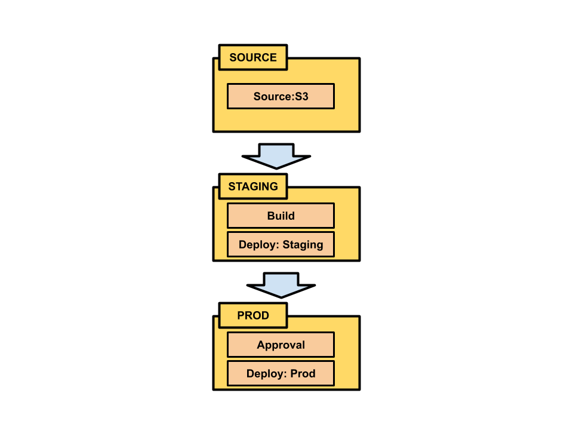
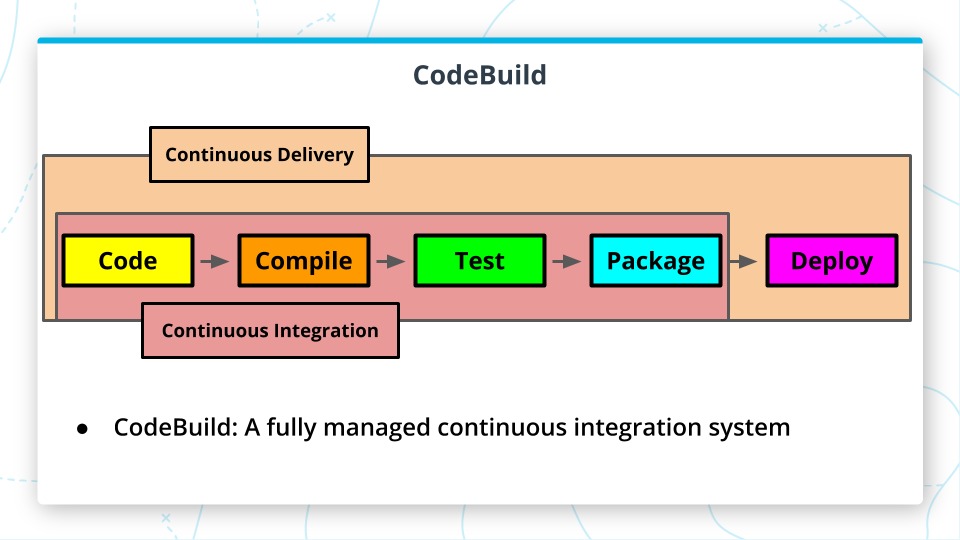

## CodePipeline
This is a continuous delivery service offered by AWS. Pipelines watch a code repository like github and are triggered whenever a new commit is made.
- Controls the release process through user defined pipelines
- Pipelines are created either through the CodePipeline console or using awscli
- Pipelines watch a source code repository, changes to this repository trigger pipeline action
- Pipelines are made up of stages
- Each stage consists of one or more actions
- There are actions to define the source repository, as well as instructions for testing, building, deploying and options for approval
- Pipelines can be managed and viewed in the [CodePipeline console](https://us-east-2.console.aws.amazon.com/codesuite/codepipeline/pipelines/).
<br>

<p align="center">
<br>
<span>An example pipeline that accesses data from an S3 bucket instead of git repo.</span>
</p>


### Additional Information
You can find additional information about CodePipeline [here](https://docs.aws.amazon.com/codepipeline/latest/userguide/concepts.html). For more information on CloudFormation templates see: [Working with CloudFormation Templates](https://docs.aws.amazon.com/AWSCloudFormation/latest/UserGuide/template-guide.html).
- When you create a CodePipeline pipeline you should do so in the context of a CloudFormation stack. CloudFormation is a service for managing the creation of Amazon resources. Resources created together are grouped in a stack. This makes it easy to see related resources in the CloudFormation console.
- CloudFormation stacks are defined in template files, (.yml). These files define all of the resources for your stack. CloudFormation templates contain sections for resources used in a stack and parameters to be set when the stack is created.
- A great way to get started with CloudFormation is to use one of the [sample templates](https://aws.amazon.com/cloudformation/resources/templates/). There are instructions for trying a sample template [here](https://docs.aws.amazon.com/AWSCloudFormation/latest/UserGuide/GettingStarted.Walkthrough.html). This walks you through using a sample template to setup and tear down the resources necessary to run a WordPress site.
<br>

Soon, you will see a template file `ci-cd-codepipeline.cfn.yml` in the project lesson.


## CodeBuild
CodeBuild is a fully managed continuous integration system offered by AWS. It can be added as an action to a **CodePipeline** stage. It is designed to build, test, and create deployable packages

<p align="center">
<br>
<span>CodeBuild can be added to a continuous delivery pipeline to handle continuous integration.</span>
</p>

### Additional Resources
- General information about CodeBuild can be found [here](https://aws.amazon.com/codebuild/).
- AWS instructions on how to create a pipeline with CodeBuild and CodePipeline can be found [here](https://docs.aws.amazon.com/codebuild/latest/userguide/how-to-create-pipeline.html).
- Documentation on Buildspec files can be found [here](https://docs.aws.amazon.com/codebuild/latest/userguide/build-spec-ref.html).
<br>

The instructions that a CodeBuild stage will follow are put in a build spec file named `buildspec.yml`. This file contains all of the commands that the build will run and any related settings. Amazon supplies [CodeBuild samples](https://docs.aws.amazon.com/codebuild/latest/userguide/samples.html), you can see examples of build spec files there. The sample for a simple Docker custom image has the build spec:
```bash
version: 0.2

phases:
  install:
    commands:
      - nohup /usr/local/bin/dockerd --host=unix:///var/run/docker.sock --host=tcp://127.0.0.1:2375 --storage-driver=overlay2&
      - timeout 15 sh -c "until docker info; do echo .; sleep 1; done"
  pre_build:
    commands:
      - docker build -t helloworld .
  build:
    commands:
      - docker images
      - docker run helloworld echo "Hello, World!"
```
You can see that it is divided into the phases ‘install’, ‘pre_build’, and ‘build’. Each phase contains commands, which are the same commands you would use to run Docker locally. You can read about the build spec syntax [here](https://docs.aws.amazon.com/codebuild/latest/userguide/build-spec-ref.html#build-spec-ref-syntax).