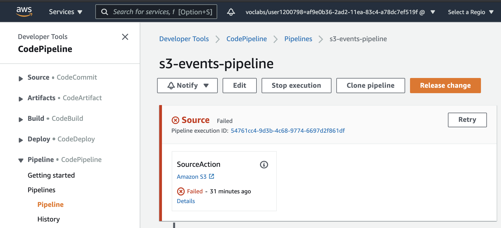
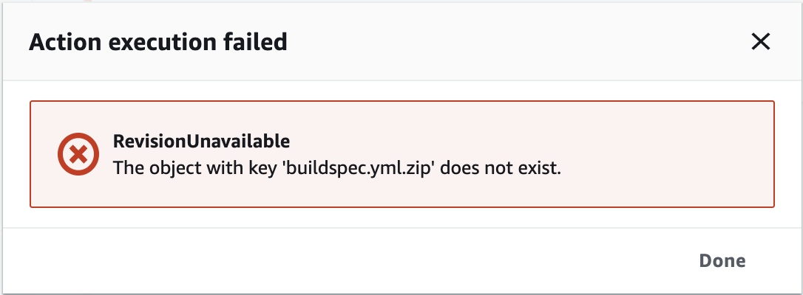
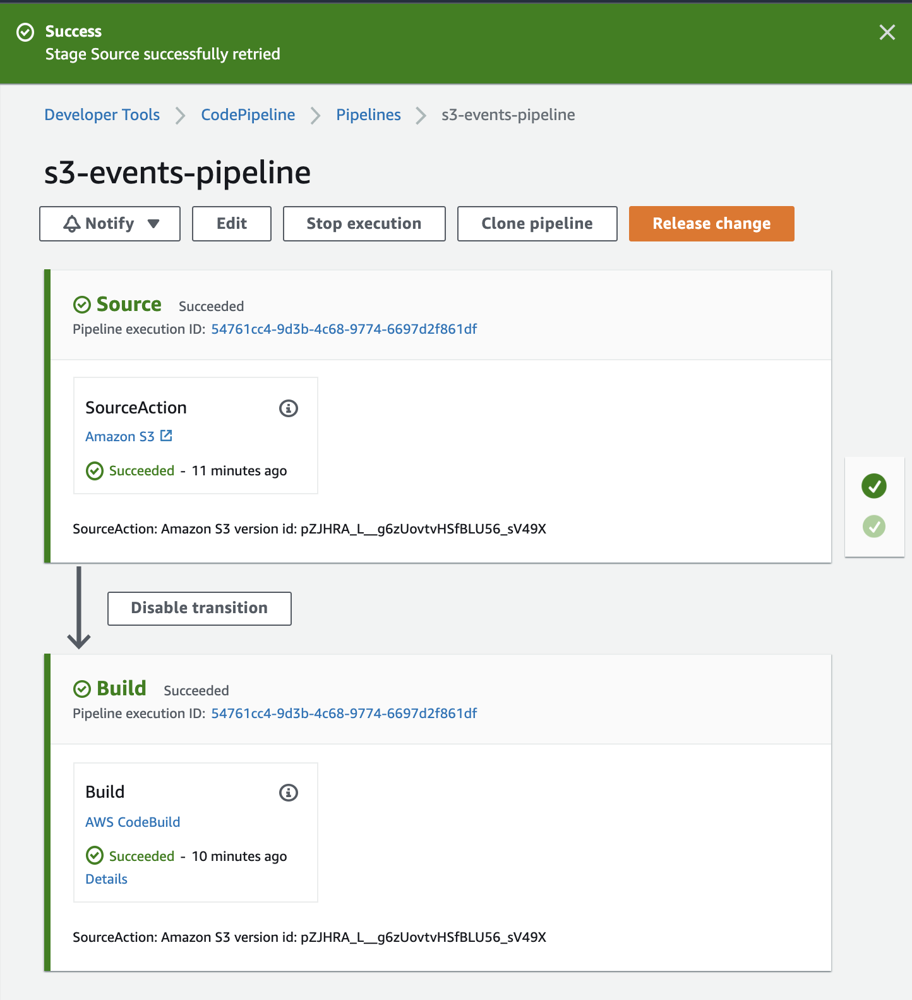

## Code Pipeline
This pipeline will read and build the contents of an S3 bucket. 
- The CodePipeline will watch for the `buildspec.yml.zip` file in the bucket and trigger a build whenever changes are detected. 
- CodeBuild will build the file and store the output in another S3 bucket

### Implementation
1. Start with the CloudFormation template file `simple-pipeline-build.yml`. Important **Resources** in this configuration file are the CodePipeline and CodeBuild resources.
    <pre><code>
    Parameters:
        SourceObjectKey:
        CodeBuildDockerImage:
            
    Resources:
        SourceBucket:
        CodePipelineArtifactStoreBucket:
        CodePipelineArtifactStoreBucketPolicy:
        CodePipelineServiceRole:
        <b>AppPipeline:</b>
        <b>CodeBuildProject:</b>
        CodeBuildServiceRole:
    </code></pre>
    Both resources are connected to each other and would internally require an 
    - IAM Roles: `CodePipelineServiceRole` and `CodeBuildServiceRole`
    - Source bucket path: `SourceBucket`
    - Destination bucket path: `CodePipelineArtifactStoreBucket`
    
    The **Resources** section defines the AWS resources created. Each resource has a type, which defines the AWS resource, and properties, which are the configuration for that resource. We have the following resources in the stack:
    | S. No | Resource name | Resource type |
    | :--- | :--- | :--- |
    | 1. | SourceBucket | AWS::S3::Bucket |
    | 2. | CodePipelineArtifactStoreBucket | AWS::S3::Bucket |
    | 3. | CodePipelineArtifactStoreBucketPolicy | AWS::S3::BucketPolicy |
    | 4. | CodePipelineServiceRole | AWS::IAM::Role |
    | 5. | AppPipeline | AWS::CodePipeline::Pipeline |
    | 6. | CodeBuildProject | AWS::CodeBuild::Project |
    | 7. | CodeBuildServiceRole | AWS::IAM::Role |

    Remember, the **order** of the creation of the resources above is crucial.
    <br><br>

2. The `buildspec.yml` is a collection of build commands and their related setting. It will be executed within a container, and output 
    ```bash
    build:
      commands:
        - echo Hello from Code Build!
    ```
    <br>

3. Create a **CloudFormation stack** using the template file from Step 1 in the AWS web-console.
    - Specify the template by uploading the file to the web-console.
    - The `SourceObjectKey` and `CodeBuildDockerImage` attributes under **Parameters** have hard-coded values for the file name that should be placed in the S3 bucket `buildspec.yml.zip`, and the docker image that should be pulled `aws/codebuild/standard:4.0` respectively.
    - These parameters will be automatically populated in the web-console.
    - Provide a stack name like `simple-pipeline-build` in Step 2, and ignore giving permissions within the web-console in Step 3, because some IAM permissions are already specified in the template.
    - Verify and finish creating the stack in Step 4. Check the box to 
        - [x] I acknowledge that AWS CloudFormation might create IAM resources.
    <br><br>

4. Once the stack is ready, navigate to the **CodePipeline service** on the web-console and check the status of the pipeline. The **initial pipeline will fail** because the S-3 bucket doesn't have the `buildspec.yml.zip` uploaded.
    - Click on the pipeline name `s3-events-pipeline` and you'll the see the error stating the file is missing
        
        
    - Navigate to the **S3 service**, and select the bucket that has the stack name as a prefix and source bucket in the name - `simple-pipeline-build-sourcebucket-xonrieta7pjm` and upload the `buildspec.yml.zip` file
        - You can also use cli for the upload. Find the bucket name with `aws s3 ls`. Upload it with
            ```bash
            ~ $aws s3api put-object --bucket simple-pipeline-build-sourcebucket-xonrieta7pjm --key buildspec.yml.zip --body buildspec.yml.zip --content-type application/zip
            ```
        - Once the file is uploaded successfully, navigate back to the **CodePipeline Service** and manually retry the build stage. 
            
            - The source stage involves connecting to the S3 bucket
            - The build stage involves executing the build commands specified in the S3 bucket file
                | Action category | Action providers | Action reference |
                | :-----: | :-----: | :----- |
                | Source | [Amazon S3](https://docs.aws.amazon.com/codepipeline/latest/userguide/action-reference-S3.html) | Triggers the pipeline when a new object is uploaded to the configured bucket and object key. |
                | Build | [AWS CodeBuild](https://docs.aws.amazon.com/codepipeline/latest/userguide/action-reference-CodeBuild.html) | When you run a CodeBuild build action, commands specified in the build spec are run inside of a CodeBuild container. |

        - The logs of the build container can be reviewed in the web-console and we can observe that the build step returns
            ```bash
            [Container] 2023/12/22 08:39:40.374520 Entering phase BUILD
            [Container] 2023/12/22 08:39:40.375201 Running command echo Hello from Code Build!
            Hello from Code Build!
            ```
            This is expected from the build phase specified in **Step 2**.
<br><br>

5. Clean Up!!!
    - You can check the **S3 service** for the source and destination buckets. Both buckets will have the same prefix name but the destination bucket will have a newly created build output folder with a zip file that was created by the CodePipeline.
    - Before deleting the stack, empty the S3 buckets so they can be deleted when the stack is deleted. This can be done in CLI or web-console.
        ```bash
        # Empty the source bucket directory
        ~ $aws s3api delete-object --bucket simple-pipeline-build-sourcebucket-xonrieta7pjm --key buildspec.yml.zip
        # Empty the destination bucket directory
        ~ $aws s3 rm s3://simple-pipeline-build-codepipelineartifactstorebuc-vasmu9r5oedn/s3-events-pipeline/ --recursive
        # Delete the stack
        ~ $aws cloudformation delete-stack --stack-name simple-pipeline-build
        ``` 
    - Most of the resources created will be deleted after emptying the S3 buckets. However, some of the S3 buckets have multiple versions that are not cleared in the step above. A third bucket is also created which was not explained. You can navigate to the S3 service and **manually** empty and delete all remaining buckets after this exercise.

***

### Alternate CLI Implementation
You can create a stack using the CLI as well. It is much simple and reusable way for creating stacks in production:
```bash
~ $aws cloudformation create-stack  \
    --stack-name another-simple-pipeline-build \
    --region us-east-2 \
    --template-body file://simple-pipeline-build.yml \
    --capabilities "CAPABILITY_IAM" "CAPABILITY_NAMED_IAM" 
```

In the command above, most of the options are self-explanatory. The `--capabilities "CAPABILITY_IAM" "CAPABILITY_NAMED_IAM"` is used because the templating is creating an IAM Role and we want to be aware of this fact. <br>

If you want to delete the stack, you should first delete the S3 buckets and then use:
`aws cloudformation delete-stack  --stack-name another-simple-pipeline-build `