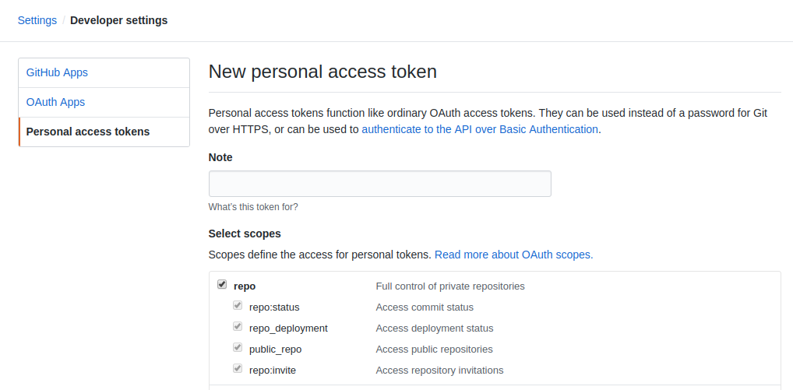

## Code Pipeline
This is similar to the required final project. A flask app will be hosted on a github repository. The CodePipeline will watch commits to the specified repository and trigger the CodeBuild service whenever commits are made. The implementation is divided into 2 main steps with multiple embedded substeps.

### Preparatory steps
1. **Fork** this git [repository](https://github.com/udacity/cd0157_Final_Pipeline) and clone it to your local account. My local fork is [here](https://github.com/Josesx506/cd0157_Final_Pipeline).<br>
    This repo has a sample "Hello World" flask application that we will deploy on EKS cluster using the AWS Codebuild and Codepipeline services. The files present in the repo are:
    ```bash

    ├── app.py         # A sample "Hello World" flask application
    ├── ci-cd-codepipeline.cfn.yml # Cloudformation template to create the Codebuild, and Codepipeline, and related resources. 
    ├── buildspec.yml  # Codebuild will execute the commands available here. 
    ├── Dockerfile     # Codebuild will build an image using the Dockerfile, and push it to the Dockerhub/or AWS ECR. 
    ├── deployment.yml # The deployment file for the Kubernetes cluster. Codebuild will apply this deployment using the one of the kubectl commands.   
    ├── iam-role-policy.json # The Policy for the IAM role that the Codebuild will assume
    ├── trust.json # The trusted entity details for the  IAM role that the COdebuild will assume
    └── aws-auth-patch.yml  # This is an autogenerated file for your reference. 
    ```
    The `iam-role-policy.json` file will help to authenticate the code build
<br><br>

2. **Create an EKS Cluster** - Create Kubernetes cluster, **eksctl-demo** using the command below:
    ```bash
    ~ $eksctl create cluster --name eksctl-demo --nodes=2 --version=1.28 --instance-types=t2.medium --region=us-east-2
    ```
    The `eksctl` command will automatically configure the local kubeconfig file so that you can communicate with the newly created cluster as:
    ```bash
    kubectl get nodes
    ```
    This takes nearly 30 minutes to create.
<br><br>

3. **Create an IAM Role for CodeBuild** - CodedBuild service cannot access and see the details of your existing EKS cluster until an IAM role is created. This is done using the `trust.json` and `iam-role-policy.json` files. Having your CodeBuild service communicate with the EKS cluster will require:
    - **Authenticate the CodeBuild**: Create an IAM role that the CodeBuild will assume. This IAM role will have two components:
        - **Trust relationship**: You (the root user) will "trust" the CodeBuild service, which will assume this IAM role.
        - **Policies**: You will mention the set of permissible actions that the Codebuild can perform, such as viewing the details of the EKS cluster.
    - **Authorize the CodeBuild**: After creating the IAM role, the authorization step is done at the EKS end. EKS has an RBAC system that allows new roles access to the cluster. The RBAC details are present in a ConfigMap (YAML file) where you will add the details of the new IAM role. <br><br>
    **Note**: IAM role is authorized in `us-east-2` which is my default region. Be careful about regions when creating roles and services to avoid errors.
    <br><br>

    1. The "trust.json" file requires an AWS id which can be obtained using 
        ```bash
        ~ $aws sts get-caller-identity --query Account --output text
        ## Returns the AWS account id similar to 115046250033
        ```
    2. Create the IAM role with the `trust.json` and view its arn using 
        ```bash
        ~ $aws iam create-role --role-name UdacityFlaskDeployCBKubectlRole --assume-role-policy-document file://trust.json --output text --query 'Role.Arn'
        # Output
        arn:aws:iam::115046250033:role/UdacityFlaskDeployCBKubectlRole
        ```
        In the command above:
        - `--role-name` allows you to give the role a name of your choice
        - `--assume-role-policy-document` option used to provide the path of the trust relationship file
        - `--output` option defines the output format
        - `--query` option decides what information to query and display on the terminal. Specifiying 'Role.Arn' means we want to view the ARN of the new role. The ARN stands for Amazon Resource Name, which uniquely identifies AWS resources.
        <br>

        If an Entity already exists error is thrown, you can delete the entity from the IAM service in the web-console by searching for the name "UdacityFlaskDeployCBKubectlRole" <br><br>
        Reference: [aws iam create-role](https://docs.aws.amazon.com/cli/latest/reference/iam/create-role.html)

    3. Attach the Policy to the IAM role with the `iam-role-policy.json` file using the command:
        ```bash
        ~ $aws iam put-role-policy --role-name UdacityFlaskDeployCBKubectlRole --policy-name eks-describe --policy-document file://iam-role-policy.json
        ```
        In the command above:
        - `--role-name` takes the name of the role to associate the new policy with
        - `--policy-name` option accepts the name of the policy document
        - `--policy-document` option is used to provide the path of the policy file
        <br>

        Reference: [put-role-policy](https://docs.aws.amazon.com/cli/latest/reference/iam/put-role-policy.html)
<br><br>

4. **Authorize CodeBuild using EKS RBAC** - [According to AWS](https://docs.aws.amazon.com/eks/latest/userguide/what-is-eks.html), the IAM role is **only** used for authentication of valid IAM entities. All authorization permissions for interacting with your Amazon EKS cluster’s Kubernetes API are managed through the native Kubernetes RBAC (Role Based Access Control) system. Authorization details are in a configmap file.
    1. Get the current configmap file from the EKS cluster and save it to a file using
        ```bash
        ~ $kubectl get -n kube-system configmap/aws-auth -o yaml > /tmp/aws-auth-patch.yml
        # Open the file with vs code
        ~ $code /System/Volumes/Data/private/tmp/aws-auth-patch.yml
        ```
        I also had to install shell command for vs code to work for me. Open the Command Palette (Cmd+Shift+P) and type `shell command` to find the Shell Command: Install 'code' command in PATH command.
    2. Open the sample authorization file from the repo `aws-auth-patch.yml`, **change** the aws id on line 14 and copy the text block below into the downloaded authorization file
        ```bash
        - groups:
          - system:masters
          rolearn: arn:aws:iam::115046250033:role/UdacityFlaskDeployCBKubectlRole
          username: build
        ```
        This adds a new group that authorizes the newly created IAM role within the EKS cluster associated with the AWS ID.
    3. Save the `/System/Volumes/Data/private/tmp/aws-auth-patch.yml` file and update the cluster's configmap using 
        ```bash
        ~ $kubectl patch configmap/aws-auth -n kube-system --patch "$(cat /tmp/aws-auth-patch.yml)"
        # Output. The respone must be shown to confirm patch
        configmap/aws-auth patched
        ```
    4. In case of the following error, re-run the above three steps beginning from the `kubectl get` command.
<br><br>

***

### Deploy the EKS Cluster
1. **Generate a Github access token** - A Github access token will allow CodePipeline to monitor when a repo is changed. A token is analogous to your Github password and can be generated [here](https://github.com/settings/tokens/). You should generate the new token (*classic*) with full control of private repositories, as shown in the image below. Be sure to save the token somewhere that is **secure**, and do not hardcode it into any of the template files.
    - Select the scopes below for this exercise
        - [x] repo
        - [x] admin:org
    
    
<br><br>

2. **Create Codebuild and CodePipeline resources using CloudFormation template** - The CloudFormation template is in the `ci-cd-codepipeline.cfn.yml` file. The main resources in the template file for this exercise are the CodePipeline:`CodePipelineGitHub` and CodeBuild:`CodeBuildProject` resources. The remaining resources are supporting resources to make the main resources functional. The Cloudformation template file ci-cd-codepipeline.cfn.yml will create the following resources:
    - ECR repository to store your Docker image.
    - S3 bucket to store your Pipeline artifacts
    - A custom provisioning logic
    - A Lambda function and its IAM role
    - CodeBuild and CodePipeline resources and their IAM roles
    <br><br>

    1. **Modify the template** - This is the template file that will create your CodePipeline and CodeBuild resources Open this file, and go to the 'Parameters' section. Ensure that the following values are used for the parameter variables:

        |Parameter | Possible Value| 
        | ---      |   ---         |
        | `EksClusterName` | `eksctl-demo` # Name of the EKS cluster you created | 
        | `GitSourceRepo` | `cd0157_Final_Pipeline` # Github repo name| 
        | `GitBranch` | `main` # Or any other you want to link to the Pipeline| 
        | `GitHubUser` | `Josesx506` # Your Github username | 
        | `KubectlRoleName` | `UdacityFlaskDeployCBKubectlRole` # We created this role earlier |
    
    2. Navigate to **CloudFormation service** in the AWS web-console and create the stack using the template file. **Make sure** the web-console region is set to `us-east-2` when creating the stack to avoid pipeline errors. This is where the EKS cluster was created.
        - Stack Name: `myFinalExerciseStack`
        - Copy and paste the git access token to avoid hardcoding it into your file
    
    3. If everything **built correctly** (*check the CodePipeline service in AWS web-console*), each time you make a commit to the remote repo, a build is triggered.
        - Expose the IP to the app by creating a load balancer service with a public IP.
            ```bash
            # Create service with public IP
            ~ $kubectl expose deployment simple-flask-deployment --type=LoadBalancer --name=my-service service/my-service exposed
            # Output
            service/my-service exposed

            # Get the IP address of the services
            ~ $kubectl get svc
            # Output
            NAME         TYPE           CLUSTER-IP     EXTERNAL-IP                                                              PORT(S)          AGE
            kubernetes   ClusterIP      10.100.0.1     <none>                                                                   443/TCP          97m
            my-service   LoadBalancer   10.100.69.33   a3b0edc0b8a1144dc8dba7c2de9777ce-632004838.us-east-2.elb.amazonaws.com   8080:32200/TCP   35s
            ```
        - Copy the `EXTERNAL-IP` for the new service into the browser. Check the deployment file for the `containerPort` which is **8080** and paste the link into the browser to access the app. `a3b0edc0b8a1144dc8dba7c2de9777ce-632004838.us-east-2.elb.amazonaws.com:8080`
        - The simple app only shows `Hello, World from Flask!`
        <br><br>
        - **Test** - To test your application endpoint, get the external IP for your service:
            ```bash
            ~ $kubectl get services simple-flask-deployment -o wide
            ```
        **Note**: The original service did not have a public IP so this didn't work for me. If errors are encountered while building, `README` commits can be made to the repo to trigger a new build after addressing the errors.


### Teardown
- This is a clean up process to remove all the resources created for this exercise. I need the credits for the final project. The template files above created 
    - Three S3 buckets
    - One EKS Cluster
    - One NodeGroup
        - Two EC2 instances
    - One Stack
    - One VPC
    - Six subnets
 <br><br>


    ```bash
    # I started with deleting the stack
    ~ $aws cloudformation delete-stack --stack-name myFinalExerciseStack

    # Get deployment name
    ~ $kubectl get deployments
    NAME                      READY   UP-TO-DATE   AVAILABLE   AGE
    simple-flask-deployment   3/3     3            3           30m

    # Delete the kubernetes deployments
    ~ $kubectl delete deployments/simple-flask-deployment
    deployment.apps "simple-flask-deployment" deleted

    # Get the cluster name
    ~ $eksctl get cluster
    NAME            REGION          EKSCTL CREATED
    eksctl-demo     us-east-2       True

    # Tear down the cluster - This takes a while and generates a lot of output text
    ~ $eksctl delete cluster eksctl-demo
    2023-12-22 05:04:36 [ℹ]  deleting EKS cluster "eksctl-demo"
    ```

    - S3 buckets were manually emptied and deleted using the AWS web console.
    - `UdacityFlaskDeployCBKubectlRole` IAM role was manually deleted
    - `eksctl-eksctl-demo-cluster` VPC was manually deleted. Associated subnets were also deleted.