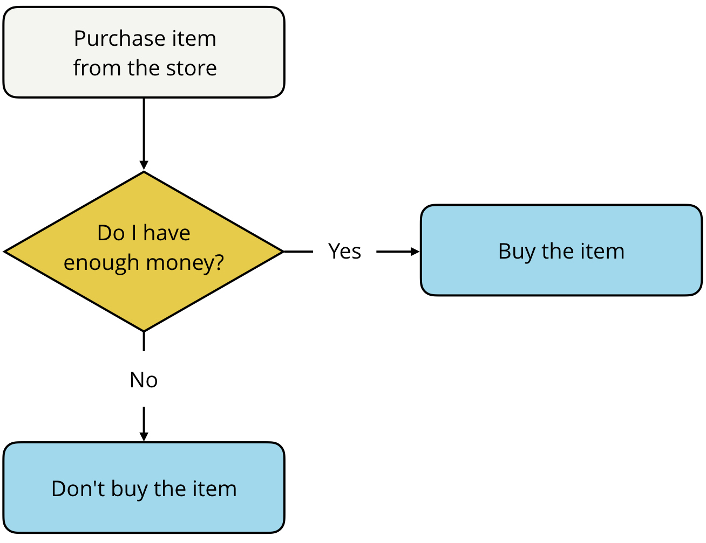

### Conditionals
A **flowchart** is a visual diagram that outlines the solution to a problem through a series of logical statements. The order in which statements are evaluated and executed is called the **control flow**. <br>


<br><br>

- **If...else statements** allow you to execute certain pieces of code based on a condition, or set of conditions, being met.
    ```js
    > if ( /*this expression is true*/ ) {
        // run this code
    } else {
        // run this code
    }
    ```
    The value inside the `if` statement is always *converted* to true or false. Depending on the value, the code inside the `if` statement is run or the code inside the `else` statement is run, but **not both**. The code inside the `if` and `else` statements are surrounded by **curly braces** `{...}` to separate the conditions and indicate which code should be run. <br>
    **TIP**: You can have an independent `if` statement but you can’t have an `else` statement without first having an `if` statement.
    <br><br>

- **Else If Statements** - In some situations, two conditionals aren’t enough. Consider the following situation. <br>
    You're trying to decide what to wear tomorrow. If it is going to snow, then you’ll want to wear a coat. If it's not going to snow and it's going to rain, then you’ll want to wear a jacket. And if it's not going to snow or rain, then you’ll just wear what you have on.
    ```js
    > var weather = "sunny";

    > if (weather === "snow") {
        console.log("Bring a coat.");
    } else if (weather === "rain") {
        console.log("Bring a rain jacket.");
    } else {
        console.log("Wear what you have on.");
    }
    ```
    By adding the extra `else if` statement, you're adding an extra conditional statement.
    <br><br>

- **Logical Operators** - This is when `if` statements are chained with `and/or` statements for more complex comparisons.
    ```js
    > var colt = "not busy";
    > var weather = "nice";

    > if (colt === "not busy" && weather === "nice") {
        console.log("go to the park");
    }
    ```
    The `&&` symbol is the logical AND operator, and it is used to combine two logical expressions into one larger logical expression. If **both** smaller expressions are true, then the entire expression evaluates to true. If **either one** of the smaller expressions is false, then the whole logical expression is false. <br>
    **Logical expressions** are similar to mathematical expressions like `11 != 12`, except logical expressions evaluate to either true or false. Similar to mathematical expressions that use `+, -, *, /, %`, there are logical operators **`&&, ||, !`** that you can use to create more complex logical expressions. <br>
    **Logical operators** can be used in conjunction with boolean values (true and false) to create complex logical expressions. <br>

    | Operator | Meaning | Example | How it works |
    | :------- | :------ | :-----: | :----------- |
    | `&&` | Logical AND | `value1 && value2` | Returns `true` if **both** `value1` **and** `value2` evaluate to `true`. |
    | `\|\|` | Logical OR | `value1 \|\| value2` | Returns `true` if **either** `value1` **or** `value2` (**or even both**!) evaluates to true. |
    | `!` | Logical NOT | `!value1` | Returns the **opposite** of `value1`. If `value1` is `true`, then `!value1` is `false`. |
    <br>

    **TIP**: Logical expressions are evaluated from **left to right**. Similar to mathematical expressions, logical expressions can also use parentheses to signify parts of the expression that should be evaluated first. <br>

    **TIP**: Float values can be rounded off with the `.toFixed()` method. e.g
    ```js
    > var balance = 325.2583;
    > console.log(balance.toFixed(2)) // Returns 325.26
    ```

- **Truthy and Falsy statements** - Every value in JavaScript has an inherent boolean value. When that value is evaluated in the context of a boolean expression, the value will be transformed into that inherent boolean value. <br>
These are similar to python values that default to true or false like 0 and 1 even when equal statements are not provided.
    1. **Falsy values** - A value is **falsy** if it converts to `false` when evaluated in a boolean context. For example, an empty String `""` is falsy because, `""` evaluates to `false`. You already know if...else statements, so let's use them to test the truthy-ness of `""`.
        ```js
        > if ("") {
            console.log("the value is truthy");
        } else {
            console.log("the value is falsy");
        }
        ```

        Here’s the list of all of the falsy values:
        1. the Boolean value false
        2. the null type
        3. the undefined type
        4. the number 0
        5. the empty string ""
        6. the odd value NaN (stands for "not a number", check out the `NaN` [MDN article](https://developer.mozilla.org/en-US/docs/Web/JavaScript/Reference/Global_Objects/NaN))
        
        That's right, there are only *six falsy values* in all of JavaScript! <br><br>


    2. **Truthy values** - A value is **truthy** if it converts to true when evaluated in a boolean context. For example, the number `1` is truthy because, `1` evaluates to `true`. Let's use an if...else statement again to test this out:

        ```js
        > if (1) {
            console.log("the value is truthy");
        } else {
            console.log("the value is falsy");
        }
        ```

        Here are some other examples of truthy values:

        ```bash
        true
        42
        "pizza"
        "0"
        # Note the null and undefined are wrapped as strings. Using it without the inverted commas will make it falsy.
        "null"
        "undefined"
        {}
        []
        ```

- **Ternary Operator** - is when you assign values to a variable based on the outcome of another boolean variable. The **ternary operator** provides you with a shortcut alternative for writing lengthy if...else statements. It is similar to lambda if-else statements in python.
    ```js
    conditional ? (if condition is true) : (if condition is false)
    ```
    An example of a ternary operator implementation is
    ```js
    > var isGoing = true;
    > var color;

    // Original if else statement
    > if (isGoing) {
        color = "green";
    } else {
        color = "red";
    }
    > console.log(color); // green

    // Ternary statement
    > var color = isGoing ? "green" : "red";
    > console.log(color); // green
    ```

- **Switch Statements** are used if you find yourself repeating `else if` statements in your code, where each condition is based on the **same** value, then it might be time to use a switch statement. A **switch statement** is an another way to chain multiple `else if` statements that are based on the same value **without using conditional statements**. Instead, you just *switch* which piece of code is executed based on a value.
    ```js
    // original if else statements that rely on the single "option" variable
    > if (option === 1) {
        console.log("You selected option 1.");
    } else if (option === 2) {
        console.log("You selected option 2.");
    } else if (option === 3) {
        console.log("You selected option 3.");
    } else if (option === 4) {
        console.log("You selected option 4.");
    } else if (option === 5) {
        console.log("You selected option 5.");
    } else if (option === 6) {
        console.log("You selected option 6.");
    }

    // switch statement without "break" clause.
    // If break arguments are not included, the statement will fall through
    switch (option) {
        case 1:
            console.log("You selected option 1.");
        case 2:
            console.log("You selected option 2.");
        case 3:
            console.log("You selected option 3.");
        case 4:
            console.log("You selected option 4.");
        case 5:
            console.log("You selected option 5.");
        case 6:
            console.log("You selected option 6.");
        }
    
    // switch statement with "break" clause.
    // A break statement is not required for the last case
    switch (option) {
        case 1:
            console.log("You selected option 1.");
            break;
        case 2:
            console.log("You selected option 2.");
            break;
        case 3:
            console.log("You selected option 3.");
            break;
        case 4:
            console.log("You selected option 4.");
            break;
        case 5:
            console.log("You selected option 5.");
            break;
        case 6:
            console.log("You selected option 6.");
            break; // technically, not needed
        }
    ```

    In the example above, if `var option = 3;` and the break statement is not included, it returns 
    ```
    You selected option 3.
    You selected option 4.
    You selected option 5.
    You selected option 6.
    ```
    When the switch statement first evaluates, it looks for the first `case` clause whose expression evaluates to the same value as the result of the expression passed to the switch statement. Then, it transfers control to that `case` clause, executing the associated statement and all the underlying cases. <br>
    The **break statement** can be used to terminate a switch statement and transfer control to the code following the terminated statement. By adding a `break` to each `case` clause, you fix the issue of the switch statement *falling-through* to other case clauses. <br>
    **`Prints:`**` You selected option 3.` <br><br>
    A switch statement is akin to providing options for an argument and it can reduce the complexity of execution compared to if else statements.

    - **Falling-through** - In some situations, you might want to leverage the "falling-through" behavior of switch statements to your advantage. <br>
    For example, when your code follows a hierarchical-type structure.
        ```js
        > var tier = "nsfw deck";
        > var output = "You’ll receive "

        > switch (tier) {
            case "deck of legends":
                output += "a custom card, ";
            case "collector's deck":
                output += "a signed version of the Exploding Kittens deck, ";
            case "nsfw deck":
                output += "one copy of the NSFW (Not Safe for Work) Exploding Kittens card game and ";
            default:
                output += "one copy of the Exploding Kittens card game.";
        }

        > console.log(output);
        // Prints: You’ll receive one copy of the NSFW (Not Safe for Work) Exploding Kittens card game and one 
        // copy of the Exploding Kittens card game.
        ```
    
        You can add a `default` case to a switch statement and it will be executed when none of the values match the value of the switch expression. This is similar to an else statement.

    