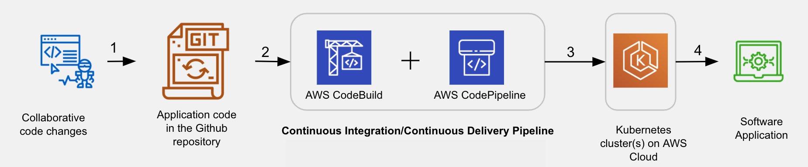

## Encode-Decode JWTs project
The app is a simple flask app that shows how to encode and decode tokens using json web tokens (jwts). The main exercise is focused on deploying the app using a kubernetes cluster with AWS services. The deployment pipeline monitors a [repo](https://github.com/Josesx506/udy_Server_Deployment_and_Containerization). Whenever new commits are pushed to the repo, it triggers a code build which performs unit tests, compiles the code, and starts the server. <br>

**NOTE**: This app has no frontend, and endpoints can only be accessed by using `curl` to query exposed IP addresses from the kubernetes cluster. <br>

The project workflow is shown below <br>


<br>

The main repo contains the following files
```bash
.
├── Dockerfile
├── aws-auth-patch.yml           # TODO - A sample EKS Cluster configMap file. 
├── ci-cd-codepipeline.cfn.yml   # TODO - YAML template to create CodePipeline pipeline and CodeBuild resources
├── buildspec.yml
├── simple_jwt_api.yml
├── trust.json                   # TODO - Used for creating an IAM role for Codebuild
├── iam-role-policy.json    
├── main.py				 
├── requirements.txt		
└── test_main.py                 # TODO - Unit Test file
```

The AWS user console can be accessed from https://115046250033.signin.aws.amazon.com/console. <br>

After the project was graded, **all the AWS resources were deleted** because of limited resources.