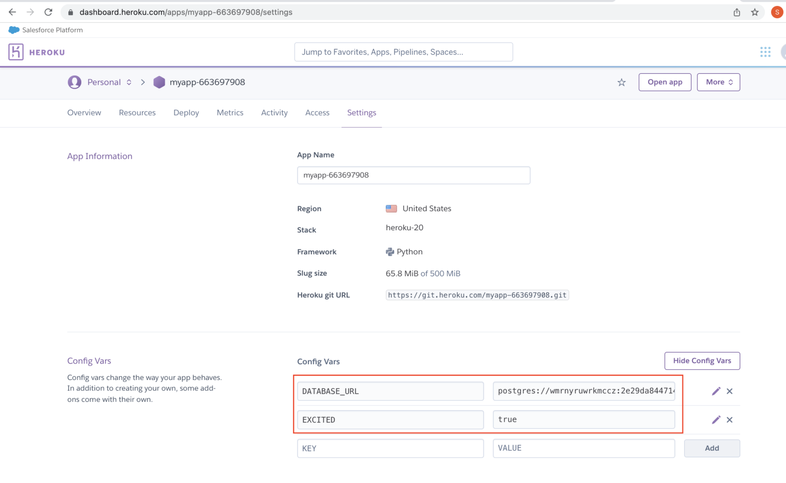

## Local Setup

- To get the app started locally, 
    1. Install postgres and verify the installation
        ```bash
        # Mac/Linux - Install Postgres using Brew. Reference: https://wiki.postgresql.org/wiki/Homebrew 
        ~ $brew install postgresql
        # Verify the installation
        ~ $postgres --version
        # Instructions to start and stop the server
        ~ $pg_ctl -D /usr/local/var/postgres start
        ~ $pg_ctl -D /usr/local/var/postgres stop
        ```
    2. Set up the directory for this project. The list of files provided are:
        ```bash
        .
        ├── app.py
        ├── models.py
        ├── manage.py        # To migrate the database to the Cloud. I didn't use this file
        ├── requirements.txt # To install dependencies
        ├── Procfile         # To mention using gunicorn to run the application
        └── runtime.txt      # To specify the exact runtime environment
        ```
    3. Create and update a virtual environment
        ```bash
        ~ $cd heroku_sample
        # OPTIONAL - Create a Virtual environment
        ~ $python3 -m venv myvenv
        ~ $source myvenv/bin/activate
        # Install python packages
        ~ $pip install -r requirements.txt
        # NOTE: If any of the python packages are modified, update the requirements file with
        ~ $pip freeze > requirements.txt
        ```
    4. Check your Starter files <br>
        The relevant files to run the app locally are:
        ```bash
        ├── app.py
        ├── models.py
        ├── requirements.txt
        └── setup.sh
        ```
        These other files are relevant for the optional Heroku deployment.
        ```bash
        ├── Procfile
        ├── manage.py
        └── runtime.txt
        ```
    5. Set up the environment variables
        ```bash
        # Make the bash script executable and activate it
        ~ $chmod +x setup.sh
        ~ $source setup.sh
        # Create a psql database
        ~ $createdb heroku_intro
        # Change the DATABASE_URL in the setup.sh file as applicable to you.
        ~ $echo $DATABASE_URL
        # postgresql://josesmac@localhost:5432/heroku_intro
        ~ $echo $EXCITED
        # true
        ```
    6. Run the app `python3 app.py`. If the command runs successfully, you can view the output at http://127.0.0.1:5000/
<br><br>

***

## Heroku Setup
[Heroku](https://www.heroku.com/platform) is a cloud platform where developers host applications, databases, and other services in several languages including Ruby, Java, Node.js, Scala, Clojure, Python, PHP, and Go. Developers use Heroku to deploy, manage, and scale applications. <br>

It is easy and flexible to use. It’s almost as straightforward as pushing a repository to Github, plus a few extra commands. <br>

Before we can do anything with Heroku, we need to do three things. 
1. First, we need to create an account with on the [Heroku Signup page](https://signup.heroku.com/).
2. Next, you need to [download/install](https://devcenter.heroku.com/articles/heroku-cli#download-and-install) the Heroku CLI (Command Line Interface) in order to run commands from the terminal that enable us to create a Heroku application and manage it.
    ```bash
    # Install, if Heroku as Standalone
    ~ $curl https://cli-assets.heroku.com/install.sh | sh
    # Or, use Homebrew on Mac
    ~ $brew tap heroku/brew && brew install heroku
    # Verify the installation
    ~ $heroku --version
    # Verify the download
    ~ $which heroku
    ```

3. Once you have the Heroku CLI, you can start to run Heroku commands! Next, log into Heroku with the following command:
    ```bash
    # If you encounter this error while trying to login to heroku
    ~ $heroku login -i                 
    heroku: Enter your login credentials
    Email: xxxxxxxxxx@gmail.com
    Password: ********
    ›   Error: Your account has MFA enabled; API requests using basic authentication with email 
    ›   and password are not supported. Please generate an authorization token for API access. 
    ›   Error ID: vaas_enrolled
    # Login with your email and API Key instead of password.
    ```

4. Create an app in Heroku and set up Heroku environment variables. <br>
    Alternatively, you can set up the environment variables in the Heroku portal after you "create" your application. To save the environment variables in the Heroku, you can go to the **Heroku dashboard >> Particular App >> Settings >> Reveal Config Vars** section and save the variables and their values, as shown in the snapshow below.
    <p align="center">
    <br>
    <span>After hitting <i>Reveal Config Vars</i>, you can define environment variables for your hosted Heroku app.</span>
    </p>
    

5. **Procfile** <br>
    You should have a Procfile, a text file in the root directory of your application, to explicitly declare what command should be executed to start your app. We'll be deploying our applications using the Gunicorn webserver. Therefore, in our case, the Procfile text file will contain the command to start the app usinig the Gunicorn:
    ```bash
    # This is similar to ENTRYPOINT in dockerfiles
    web: gunicorn app:app
    ```
    Just make sure your app is housed in app.py as it is in the sample project. Gunicorn is a pure-Python HTTP server for WSGI applications.

6. Using `runtime.txt` <br>
    A `runtime.txt` specifiies which exact Python version will be used. Whereas, a `requirements.txt` is used by Python’s dependency manager, Pip. <br>
    In our case, we are going to use python-3.9.18. Here is the list of [supported Python runtimes](https://devcenter.heroku.com/articles/python-support#supported-runtimes) in Heroku.

7. **Reference** <br>
    Here the reference that you can refer if you need help with your personal application: [Getting Started on Heroku with Python](https://devcenter.heroku.com/articles/getting-started-with-python).

***
### Database Migrations with Heroku
Heroku can run all your migrations to the database you have hosted on the platform. Here are the "Database Migrations" steps you will follow in the detailed Deployment guide on the next page.
- Include a `manage.py` file in your application.
- You'll need the following three new packages for the **database migration** step. These packages are already mentioned in the `requirements.txt`.
    ```bash
    ~ $pip install Flask-Script==2.0.6
    ~ $pip install Flask-Migrate==2.7.0
    ~ $pip install psycopg2-binary==2.9.1
    ```
- To migrate your local database to another database in the Heroku cloud, you will have to run these commands:
    ```bash
    ~ $flask db init
    ~ $flask db migrate
    ~ $flask db upgrade
    ```
Those last commands are the essential process that Heroku will run to ensure your database is architected properly. We, however, won't need to run them again unless we're testing the app locally.

***
### Deploying to Heroku
1. **Run local migrations** <br>
    ```bash
    # Create a app/migration repository
    ~ $flask db init
    ~ $flask db migrate -m "Initial migration"
    # Create the migrations locally, and later, commit and deploy to Heroku
    ~ $flask db upgrade
    ```
2. This folder is already hosted on github and I didn't create a new repo. <br>
    Create a new folder, create an Heroku app, and connect the folder to the newly created Heroku app.
    ```bash
    ~ $heroku create [my-app-name] --buildpack heroku/python
    # For example, Note: You need a credit card for the app to be created and to use addons.
    ~ $heroku create heroku-intro --buildpack heroku/python
    # Creating ⬢ heroku-intro... done
    # Setting buildpack to heroku/python... done
    # https://heroku-intro-ee54c26f9ca2.herokuapp.com/ | https://git.heroku.com/heroku-intro.git
    ```
    where, [my-app-name] is a unique name that nobody else on Heroku has already used. You have to define the build environment using the option `--buildpack heroku/python`. The `heroku create` command will create a Git "remote" repository on Heroku cloud and a web address for accessing your web app. You can check that a remote repository was added to your git repository with the following terminal command:
    ```bash
    ~ $git remote -v
    # If you cannot see the Heroku "remote" repository URL in the output, you can use the command:
    ~ $git remote add heroku [heroku_remote_git_url]
    ```
3. Add [PostgreSQL addon](https://devcenter.heroku.com/articles/ah-postgresql-stackhero) for our database <br>
    Heroku has an [addon for apps](https://devcenter.heroku.com/categories/add-on-documentation) for a postgresql database instance. Run this code in order to create your database and connect it to your application:
    ```bash
    # Check addons for heroku app
    ~ $heroku addons
    # Output is "No add-ons for app heroku-intro."
    # Create a new addon for postgresql. The old addon has been deprecated
    # ~ $heroku addons:create heroku-postgresql:hobby-dev --app [my-app-name]
    ~ $heroku addons:create ah-postgresql-stackhero:ist-b8yguc --app [my-app-name]
    ```
    In the command above,
    - `ah-postgresql-stackhero` is the name of the addon that will create an empty Postgres database.
    - `ist-b8yguc` on the other hand specifies the tier of the addon, in this case the paid version that starts at ~$0.026/hour which has a storage data limit of 10GB.
    
4. Configure the App <br>
    After the database has been created, you would want to set up the Environment variables in the Heroku Cloud, specific to youor application. Run the following command to fix your DATABASE_URL configuration variable in Heroku.
    ```bash
    ~ $heroku config --app [my-app-name]
    # Output is 
    # STACKHERO_POSTGRESQL_ADMIN_PASSWORD: ********
    # STACKHERO_POSTGRESQL_HOST:           jr3iif.stackhero-network.com
    # The DB_URL is postgres://admin:<admin_password>@jr3iif.stackhero-network.com:5432/admin?sslmode=require 
    ```
    Update the local environment variables with the remote psql instance and source it.
    ```bash
    ~ $export DATABASE_URL="postgres://admin:<admin_password>@jr3iif.stackhero-network.com:5432/admin?sslmode=require"
    # Verify
    echo $DATABASE_URL
    ```
    Apart from the DATABASE_URL, for the sample project, add two additional variables to the Heroku app in the web-console: 
    - `EXCITED:true`.
    - `DATABASE_URL:postgres://admin:<admin_password>@jr3iif.stackhero-network.com:5432/admin?sslmode=require`

5. Push the changes to git
    Whenever you make any changes to your application folder contents, you will have to commit your changes:
    ```bash
    # Every time you make any edits to any file in the web_app folder
    # Check which files are ready to be committed
    ~ $git add -A
    ~ $git status
    ~ $git commit -m "heroku setup"
    # Assuming you have already committed all your local edits.
    ~ $git push heroku master
    ```

6. Migrate the database
    ```bash
    # Make sure the local db was migrated locally and the migrations folder is uploaded to the repo
    # This allows the remote db to be monitored for changes
    ~ $heroku run flask db upgrade --app heroku-intro
    ```

7. Troubleshoot <br>
    If you encounter errorr, such as *FileNotFoundError* or *Path* doesn't exist, try to figure out by opening a bash terminal into the Heroku platform and confirming if all files are correctly pushed to the remote, as:
    ```bash
    ~ $heroku run bash
    # Run inside the bash terminal into the Heroku platform
    ~ $pwd
    ~ $ls -al
    ```

### That's it!
And now you have a live application! Open the application from your Heroku Dashboard and see it work live! Make additional requests using curl or Postman as you build your application and make more complex endpoints. <br>
Now you are ready to dive in to the Capstone. Good luck, fullstack developers! Have fun with it! <br>
Access the application at https://heroku-intro-ee54c26f9ca2.herokuapp.com/. Each app will have a different link. You can delete the app after completion to avoid fees. <br>

Troubleshooting - Having trouble with Heroku? Start with these resources:
- [Deployment Docs](https://devcenter.heroku.com/categories/deployment)
- [Getting Started with Python](https://devcenter.heroku.com/articles/getting-started-with-python)

<br><br>

***
## Render Setup
[Render](https://render.com/) is a unified cloud platform to build and run apps and websites. Render provides all services in one place, including web services, static sites, background workers, cron jobs, Dockerfiles, private services, PostgreSQL, and Redis. <br>
Render is an alternative tp Heroku that provides free-tier services for small projects and hobbyists. See pricing plans at [Render pricing](https://render.com/pricing). <br><br>

Here's how to deploy a Flask app and Postgres database on Render Console:
1. Create a Render account
2. Set up a Database Service with Postgres
3. Deploy a Flask app with Render's Web Service

We'll go through each step in detail. <br>


Before you get started, make sure to download or clone the Flask app example for the exercise below from the [Udacity | Render Cloud Example repo](https://github.com/udacity/render-cloud-example). <br>
⚠️ :warning: After you complete this exercise, please suspend or delete the services to avoid any charges.

### Step 1: Create a Render Account
From the Render.com landing page, click the "Get Started" button to open the [sign-up page](https://dashboard.render.com/register). You can create an account by linking your GitHub, GitLab, or Google account or provide your email and password.

### Step 2: Set up a Database Service with Postgres
Once you are logged in, you will be redirected to the Render Dashboard web-console. Click the **New PostgreSQL** button to set up a Postgres cloud database. <br>
On the **New Postgres** page:
1. Enter a name for the new database service: **postgres-deployment-example**
2. Select an instance type: **Free**
3. Click **Create Database** button

### Step 3: Deploy Apps with Render's Web Service
Once the database is set up, we can go back to Render Dashboard web-console and create a new **Web Service**. <br>
Connect your Flask app from GitHub or GitLab repo to the Web Service. On the **New Web Service** page:
1. Provide a name for the new database service: **render-deployment-example**
2. Select an instance type: **Free**
3. Enter the build command: `pip install -r requirements.txt`
Note: Render will install the dependencies from the "requirements.txt" provided in the GitHub repo.<br><br>

**Connect the Database Service and Web Service** <br>
Before you click **Create Web Service**, you will need to connect the Postgres service so your Flask app can read and write data to the Postgres database. To connect the services, you can copy the Postgres database URL and paste it into the environment variables within the web service.<br><br>

**Copy Postgres Database URL** <br>
From the Postgres service (name: "postgres-deployment-example"), click the "Info" side navigation and copy the **Internal Database URL** from the Connections page.<br><br>

**Paste the Database URL in the Web Service Environment Variable** <br>
From the web service (name: "render-deployment-example"), create an environment variable with the key: **DATABASE_URL** and **Database URL** value copied from the Postgres service.<br>
Add a second Environment variable with the key **EXCITED** and value **true**. <br>
You can store other credentials for your apps by adding more environment variables.<br>
After the Web Service is ready, you can open your Flask app on the browser by clicking the app URL under the title on the Web Service page. <br>
Check that your app is running! It should show the message :
```bash
Hello!!!!! You are doing great in this Udacity project.
# Now navigate to the coolkids page. You should see this message:
Be cool, man, be coooool! You're almost a FSND grad!
```

Congratulations! You have deployed the sample app on the Render Cloud platform. <br>
⚠️ :warning: After you complete this exercise, please suspend or delete the services to avoid any charges.