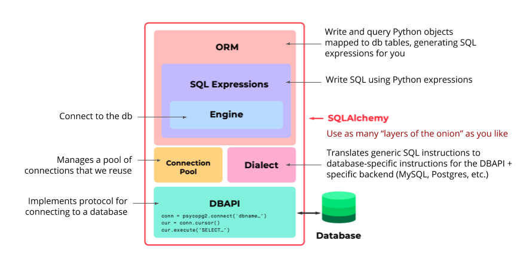

### Sqlachemy overview
This python package allows Object Relational Mapping (ORM) of sql database rows and columns of a SQL table into python classes and objects. <br>
There are 5 levels of abstraction which sqlalchemy uses to make database interactions easier.
- Dialect
- Connection Pool
- Engine
- SQL Expressions
- ORM

<br><br>

**Dialects** allow it to work with multiple sql backends without changing the python code which is useful for testing e.g. use SQLite for developer environment since its lighter, and Postgres for production. <br><br>
**Connection Pool** also allows it to open and close database connections automatically reducing the amount low-level sql code written. It improves performance at scale by:
1. Handing dropped connections.
2. Avoiding very small calls to the db.
3. Avoiding opening and closing connections for every data change. 


**Engine** is the lowest layer of abstraction. It allows sqlalchemy to work with low level sql similar to other DBAPI's like `psycopg2`.
```python
from sqlalchemy import create_engine

engine = create_engine('postgres://...')
conn = engine.connect()
result = conn.execute('SELECT * vehicles')

result.close()
```
This can be used for small tests to validate queries etc.<br><br>

**SQL Expressions** lets you perform SQL queries/statements using python objects.
```python
# Create a Table class and instantiate it as a variable
todos = Table('todos',....)

# Call the insert statement as a method
ins = todos.insert().values(
    description = 'Clean my room',
    completed = False
)

# Call the select statement as a method
sel = select([todos])

# Execute and commit changes to the db
conn = engine.connect()
result = conn.execute(ins)
result = conn.execute(sel)

# Close the connection
result.close()
```

**ORM** is the highest layer of abstraction in SQLALchemy. It lets you compose SQL expressions by mapping python classes of objects to tables in the database, and wraps the `SQL Expressions` and `Engine` to work together to interact with the database.
With sqlalchemy, the entire `fyyur` website project can be written with python.